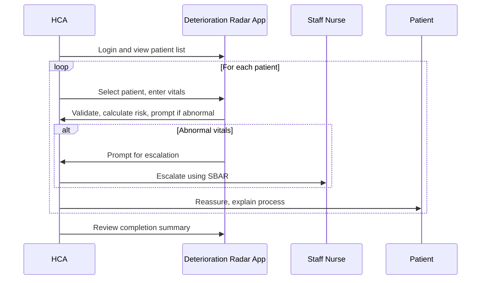
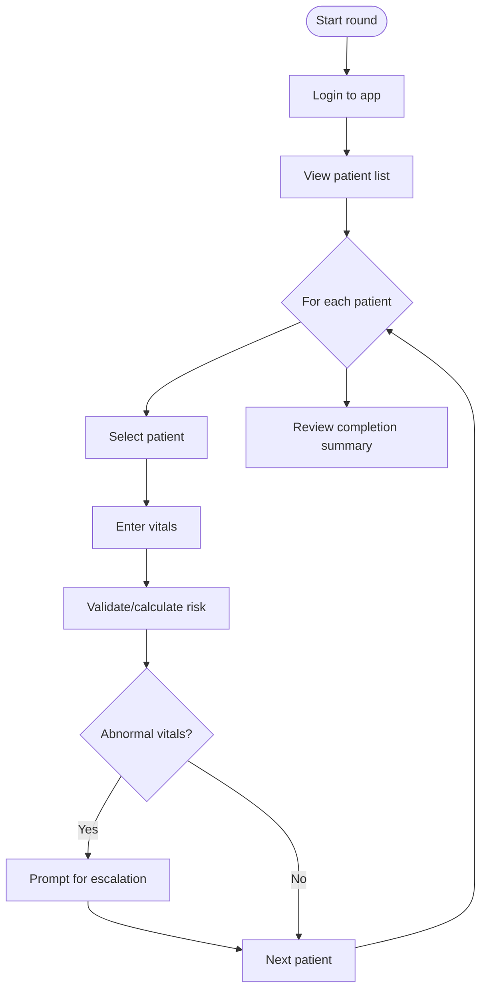

# Journey: Rapid Vital Signs Entry in Overflow Area

**Primary Actor:** Aisha Begum (Healthcare Assistant)
**Duration:** 10–20 minutes per round
**Preconditions:**
- Patients are present in corridor/overflow spaces
- Aisha is assigned to these patients and has access to the Deterioration Radar app (mobile device)
- Patients have NHS numbers and are registered in the system
**Success Criteria:**
- All assigned patients have up-to-date vital signs recorded
- Overdue/missing observations are flagged and addressed
- Data is available for escalation and audit

---

## Main Flow
| Step | Actor | Action | System Response | Notes |
|------|-------|--------|-----------------|-------|
| 1 | Aisha | Logs into Deterioration Radar on mobile | Displays patient list for assigned area | Secure login, mobile UI |
| 2 | Aisha | Selects first patient in corridor | Loads patient summary and last obs | Shows overdue/missing obs prompt if needed |
| 3 | Aisha | Enters new vital signs (manual entry) | Validates data, calculates risk score | Flags if any value is abnormal |
| 4 | Aisha | Saves entry and moves to next patient | Updates patient status, refreshes list | Patient moves down priority board if risk reduced |
| 5 | Aisha | Repeats for all assigned patients | System tracks completion | Prompts if any patients missed |
| 6 | Aisha | Reviews summary of completed obs round | System displays completion status and outstanding patients | Can export/print summary if needed |

---

## Decision Points
- **Decision:** Patient is not found in system
  - **Path A:** Register patient manually (minimal data)
  - **Path B:** Escalate to nurse-in-charge for support
- **Decision:** Abnormal vital signs detected
  - **Path A:** System prompts for escalation (SBAR template)
  - **Path B:** Continue to next patient if within normal range

---

## Touchpoints
- **Digital:** Deterioration Radar mobile app, secure login, patient list, data entry forms, prompts/alerts
- **Physical:** Patient wristbands, observation charts (if any), mobile device
- **People:** Aisha (HCA), patients, staff nurse (for escalation), IT support (if app issue)

---

## Pain Points & Opportunities
- Paper obs charts can be lost or delayed
- Difficult to track patients in non-standard areas
- Manual data entry is time-consuming
- Opportunity: Automated reminders, single patient list, mobile-friendly UI, real-time prompts

---

## Sequence Diagram: Actor Interactions

---

## Process Flow: Decision Logic

