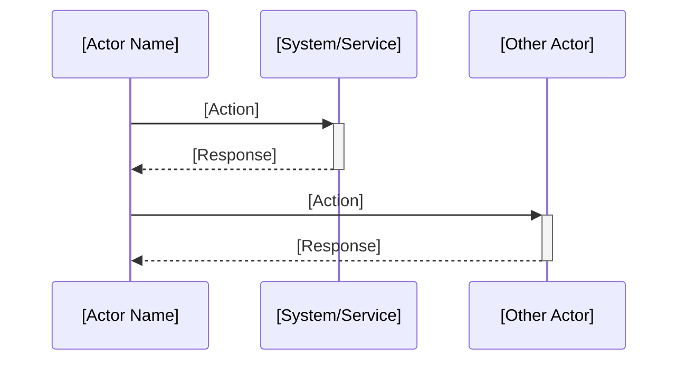
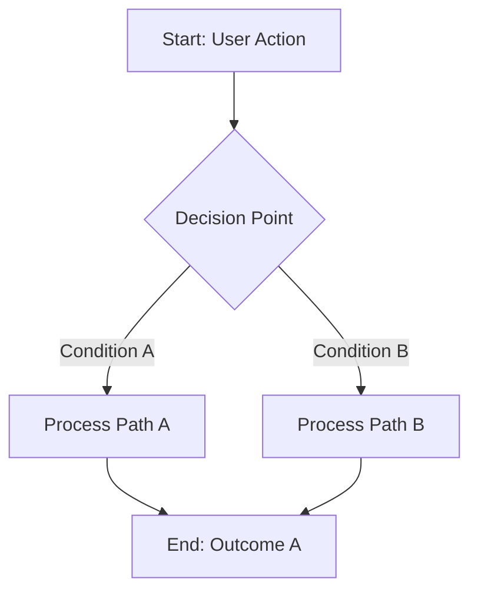

# Journey: [Title]

**Primary Actor:** [Persona Name]  
**Duration:** [E.g., 15 minutes, 2-3 days, ongoing]  
**Preconditions:** [What must be true before this journey starts]  
**Success Criteria:** [How we know the journey was successful]

## Overview

[2-3 paragraphs describing the journey, its importance, and context within the system. Include:
- Why this journey is important
- What problem it solves
- How it demonstrates key functionality]

## Main Flow

| Step | Actor | Action | System Response | Touchpoint | Notes |
|------|-------|--------|-----------------|-----------|-------|
| 1 | [Persona] | [What they do] | [What system does] | Web / Mobile / In-person | [Key details] |
| 2 | [Persona] | [What they do] | [What system does] | Web / Mobile / In-person | [Key details] |
| 3 | [Persona] | [What they do] | [What system does] | Web / Mobile / In-person | [Key details] |

## Sequence Diagram: Actor Interactions

## Decision Points & Variations

### Decision Point 1: [Scenario]
**Condition:** When [situation occurs]

**Path A: [Outcome A]**
- [Step 1 for Path A]
- [Step 2 for Path A]

**Path B: [Outcome B]**
- [Step 1 for Path B]
- [Step 2 for Path B]

## Process Flow: Decision Logic

## Touchpoints

### Digital Touchpoints
- [System/App name]: [What happens here]
- [System/App name]: [What happens here]

### Physical Touchpoints
- [Form/Document name]: [What's needed]
- [In-person interaction]: [Where and why]

### People Involved
- [Role name]: [Their involvement]
- [Role name]: [Their involvement]

## Pain Points & Opportunities

### Current Pain Points
- **Pain Point 1:** [Description of problem]
- **Pain Point 2:** [Description of problem]

### Opportunities for Improvement
- **Opportunity 1:** [How we could improve]
- **Opportunity 2:** [How we could improve]

## Accessibility Considerations

- [WCAG 2.1 AA requirement being addressed]
- [Alternative format or interaction method]

## Related Personas

- [Persona A]: [Their role in this journey]
- [Persona B]: [Their role in this journey]

## Related Journeys

- [Journey Name]: [How it connects]
- [Journey Name]: [How it connects]

## Notes

[Any additional context, assumptions, or important details]

## Data Elements

[Key data fields used or created during this journey]
- [Field name]: [Description]
- [Field name]: [Description]

## Service Level Expectations

- [Expected response time or availability]
- [Error handling and recovery procedures]
